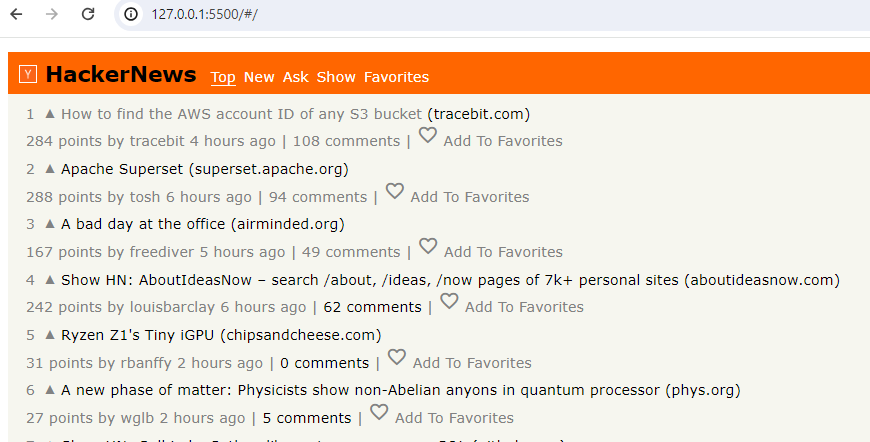

# Hacker News Clone

A Vanilla JavaScript project cloning [Hacker News](https://news.ycombinator.com/news).

## Features

- View comment and story from API - https://node-hnapi.herokuapp.com
- Add and remove story to favorites
- No user login

## Concepts Applied in the Project

- **Routing**: SPA routung with a vanilla JavaScript lib - navigo([npm](https://npmjs.com/package/navigo); [github](https://github.com/krasimir/navigo/blob/master/README_v7.md))
- **Asynchronous JavaScript**: Made asynchronous API calls with `fetch` to retrieve stories and comments.
- **State Management**: Use a reducer to manage state - `getState()` and `dispatch(action)`.
- **Event Handling**: Implemented event listeners for active links and favorite actions.
- **DOM Manipulation**: Update the content of the web page.
  - `link.getAttribute('href')`
  - `link.classList.add('active');`
  - `link.classList.remove('active');`
  - `view.innerHTML = 'No Story'`

More bacis concepts like:
* **HTML data attribute**: `data-*` attribute translate to `this.dataset.*`.
* **Modules**: Leveraged ES6 modules to structure the codebase into reusable pieces.
* **Object De-structuring**: Like `Story({...story, index : index + 1, isFavorite: checkFav(favorites, story)}))`.
* **Shorten Conditionals**: Ternaries operator(` ? : `) and short circuiting(`|| &&`).
* **Template Literals**: ` `` ` allowing for multi-line strings, string interpolation with embedded expressions.
* **Array Mapping**: `map()` with an index parameter.

## File Structure

- `/components`: Contains reusable components like `Comment.js` and `Story.js`.
- `/img`
- `/pages`: Includes scripts for different pages of the application.
- `/utils`
- `app.js`: The main JavaScript file that initializes the app.
- `index.html`
- `router.js`: Handles client-side routing.
- `store.js`: Manages global state.
- `style.css`

## Installation

To run this project locally, you'll need to serve the files through an HTTP server. Because navigo is fetched over the network using protocol-relative URLs, which require an HTTP or HTTPS protocol. Directly opening the files in a browser with a file:// URL will not work.

If opened in VSCode, there is a Live Server([link](https://marketplace.visualstudio.com/items?itemName=ritwickdey.LiveServer)) extention available.
 

## Preview

